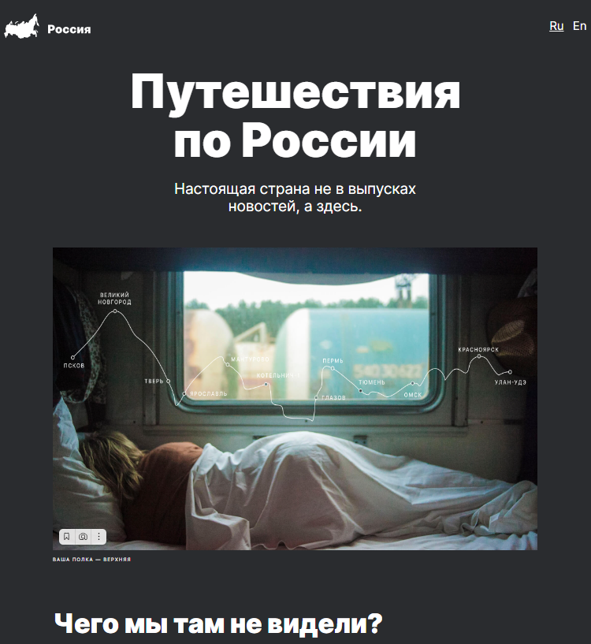

# Проект: Путешествие по России от _"Yandex Practicum"_.

Проект "Путешествия по России" представляет собой веб-страницу, разработанную с целью показать разнообразие и красоту путешествий по России.
[Ссылка на gh-pages](https://dmitry145528.github.io/russian-travel/#) |  [Ссылка на макет в Figma](https://www.figma.com/file/yR8VhLDRMkrZC9YxSOfLem/Sprint-3_-Russia-_-desktop-%2B-mobile?type=design&node-id=28503-0&mode=design&t=w8RGZKH3ZkVAqPXR-0)



## Структура проекта:

* Header секция содержит верхнюю часть страницы, включая логотип и переключатель языка.

* Content секция содержит основное содержимое страницы, включая различные блоки с информацией о путешествиях по России.

* Lead секция содержит блок с заголовком, подзаголовком и изображением, представляющим основную идею статьи.

* В секции Intro находится блок с кратким введением и списком фактов о России.

* Photo-grid секция с сеткой фотографий, представляющих различные места России.

* В секции Places представлены различные места для посещения в России. Каждое место содержит заголовок, ссылку на веб-сайт и описание.

## Что сделал:

* Создал HTML и CSS файлы для построения страницы проекта.

* Вставил изображения и контент, соответствующие каждой секции проекта.

* Оптимизировал загрузку и производительность страницы.

* Реализовал адаптивную вёрстку для корректного отображения страницы на различных устройствах и экранах.

## Реализованный функционал:

* Ссылки для перехода на сторонние сервисы: Добавлены ссылки для быстрого доступа к сервисам, таким как Карты, Погода, Расписание, Календарь и Путешествия.

* Адаптивная вёрстка: Реализована адаптивная вёрстка для корректного отображения сайта на различных устройствах и экранах, обеспечивая удобство использования как на компьютере, так и на мобильных устройствах.

* Статичность сайта: Сайт остаётся статичным, что означает отсутствие динамического контента и интерактивных элементов, таких как формы обратной связи или динамически загружаемые данные.

## Планы по доработке:

* Добавление английской версии: Создание английской версии сайта для расширения аудитории и улучшения доступности для иноязычных пользователей.

## Технологии:

* Технология ___Flex-вёрстка___.
* Технология ___@font-face___.
* Технология для сложных сеток ___Grid-Layout___.
* Технология гибких элементов и блоков, при помощи относительных единиц ___vw/vh/%/rem/em___.
* Технология псевдокласса ___:hover___.
* Технология псевдоэлемента ___::before___.
* Технология позиционирования элементов.
* Технология ___БЭМ (Nested)___.
* Технология адптации вёрстки по разные устройства __@media screen__

## Инструкция по запуску:

1. **Склонировать репозиторий:**
   ```sh
   git clone git@github.com:Dmitry145528/russian-travel.git

2. Перейдите в папку с проектом, затем откройте файл index.html в вашем любимом браузере.